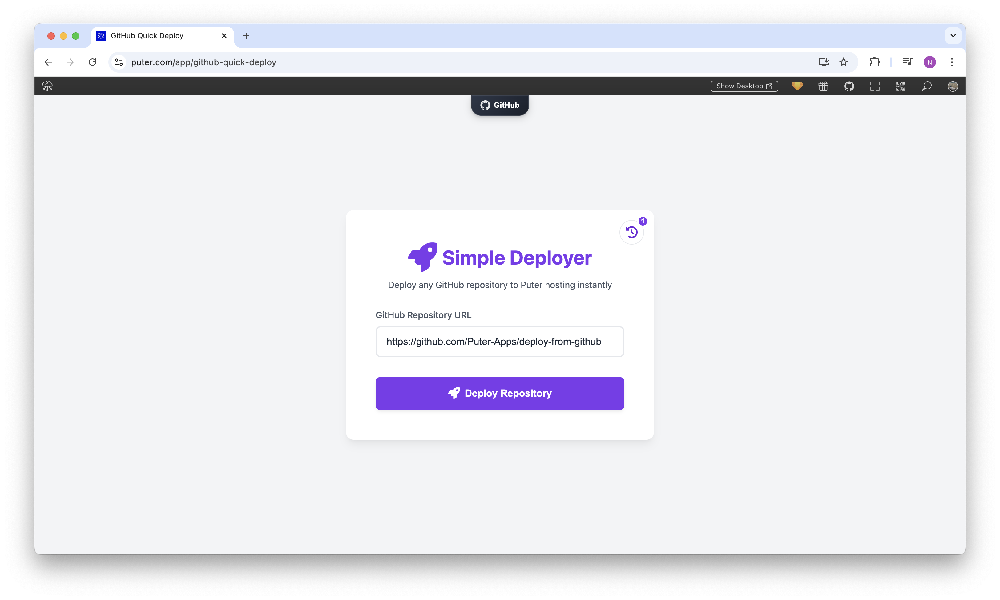

<h1 align="center">
  <a href="https://puter.com/app/github-quick-deploy" target="_blank">Simple GitHub Deployer</a>
</h1>

  

A simple web application that allows you to instantly deploy any GitHub repository to Puter hosting with just a few clicks.

## Features

- **One-Click Deployment**: Deploy any GitHub repository to a live website in seconds
- **No Configuration Required**: Works with any static website repository
- **Deployment History**: Keep track of all your previous deployments
- **Instant Live URLs**: Get a unique subdomain for each deployment
- **Persistent Storage**: All deployments are saved to your [Puter Account](https://puter.com)
- **Modern UI**: Clean, responsive interface that works on all devices

## How It Works

1. Enter the URL of any GitHub repository
2. Click "Deploy Repository" and authenticate with your Puter account
3. The app automatically downloads all files from the repository
4. Files are stored in your Puter drive and hosted on a unique subdomain
5. Access your live site immediately with the provided URL

## Technical Details

This application uses:
- **Puter.js** for authentication, file system operations, and web hosting
- **GitHub API** to fetch repository content
- **Vanilla JavaScript** for the frontend logic
- **Modern CSS** with responsive design principles
- **Key-Value Storage** for saving deployment history

## Puter.js Features Used

- **Authentication**: User sign-in and account management
- **File System**: Creating directories and writing files
- **Hosting**: Deploying static websites with custom subdomains
- **Key-Value Store**: Saving and retrieving deployment history
- **Networking**: Making HTTP requests to GitHub API
- **Utilities**: Generating random subdomain names

## Getting Started

1. Access the application through [Puter](https://puter.com)
2. Enter a GitHub repository URL (e.g., https://github.com/username/repository)
3. Click "Deploy Repository" and follow the authentication prompt
4. Wait for the deployment to complete
5. Visit your new website using the provided URL

## License

MIT
